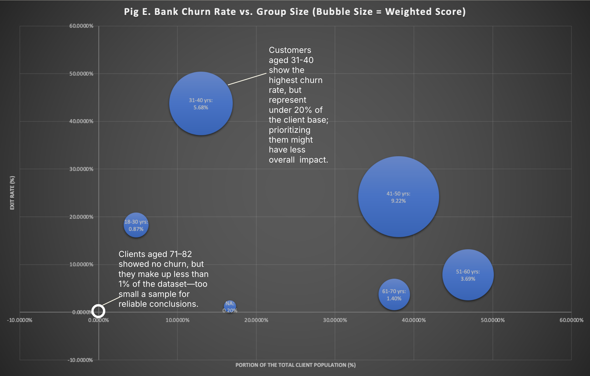
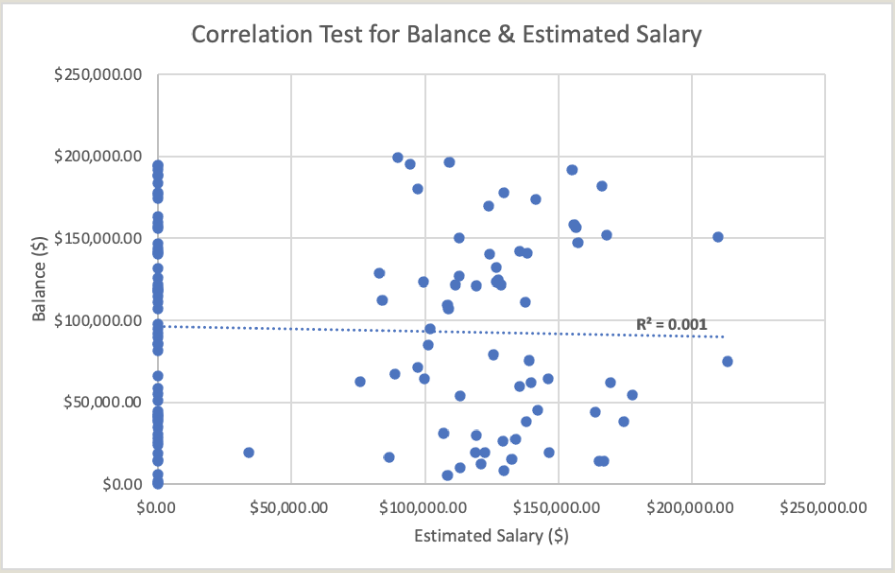
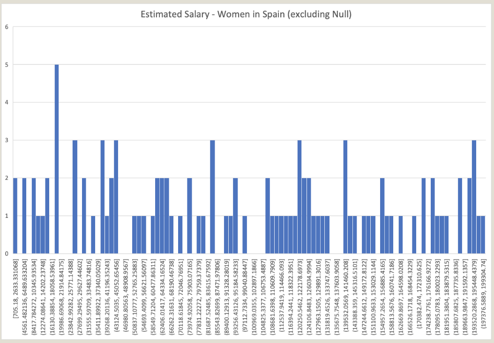
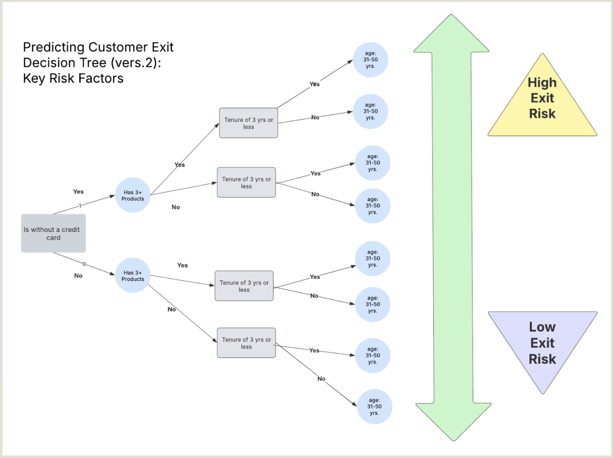
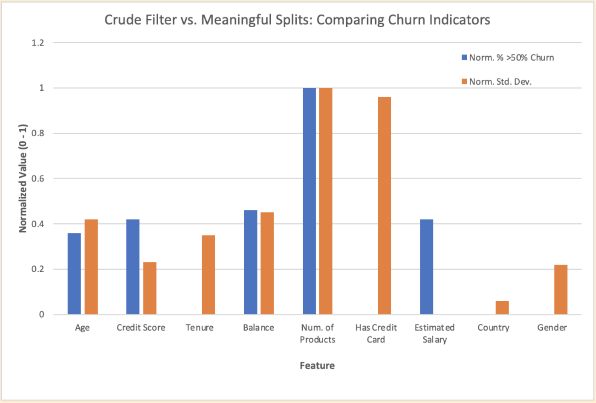

# Bank Churn Prediction 💰

**Project Date:** February 2025  
**Category:** Business Intelligence  

## Project Overview

**Objective:** Identify top predictors of customer churn and build an interpretable model to support retention strategy.

**Data:** Proprietary customer dataset (age, credit score, balance, tenure, etc.)

**Methods:**
- Churn-weighted feature scoring
- Volatility ranking via standard deviation
- Manual decision tree modeling (Lucidchart)
- Model validation via logical split testing

---

## TL;DR

- Not all high-churn segments are impactful—some groups churn at high rates but represent tiny slivers of the customer base.  
- Sensitive or noisy fields (like credit scores and salary) should not always be imputed—sometimes leaving nulls preserves model integrity.  
- Churn is concentrated among customers with **≤3 years tenure**, **3+ products**, and **no credit card**—these represent the highest-risk profile.

**Recommendation:** Prioritize outreach to new customers without credit cards, and reinforce loyalty among stable, long-tenure clients.

---

## Key Insights

### 1. High Churn ≠ High Impact

**Insight:** Groups with high churn rates may be too small to justify targeted retention campaigns.

**Example:** Customers aged 31–40 have the highest churn rate, but make up less than 20% of the client base.

  
***FIG. A:*** *Each group’s “weighted score” multiplies churn rate by population share, to emphasize scalable risk.*

⚠️ **Statistical Caveat:** Zero-churn groups (e.g. clients aged 71–82) are too small (<1%) for reliable modeling.

---

### 2. Don't Always Impute—Especially for Noisy or Sensitive Variables

**Credit Score:** Skipped imputation—statistically opaque, ethically fraught.

**Estimated Salary:**
- Tried subgroup-based fill (e.g. by gender or country)  
- Small sample sizes + high variance made imputation noisy  
- Linear regression ruled out (R² = 0.001 with Balance)

  
***FIG. B:*** *No meaningful relationship between Estimated Salary and Balance (R² = 0.001)*

  
***FIG. C:*** *Histogram of salaries for Spanish women—no clear pattern emerged to support fill-in.*

➡️ **Decision:** Leave NA values as-is to avoid introducing noise or false certainty.

---

### 3. Top Churn Risk = No Credit Card + 3+ Products + ≤3 Years Tenure

**Tree Logic:**
- Split features by churn standard deviation (proxy for information gain)
- Balanced sample sizes across branches for interpretability and validation

**Highest-Risk Group:**
- No credit card  
- 3+ products  
- ≤3 years tenure

Other patterns:
- Ages 41–50 had highest weighted churn score  
- 31–40 group: close second in churn and largest overall segment  
- Low-tenure customers outside that age range still showed 66% churn

  
***FIG. D:*** *Final model structure based on validated decision splits.*

---

## Bonus: Modeling Experiment

### Crude Heuristic Test: “Decision Gain”

**Idea:** Score features by how often their values exceed 50% churn—simple but flawed.

**Why It Failed:**
- Doesn’t factor in how common each value is  
- Ignores population impact  
- Flat-scores binary fields  
- Misses useful variance within a feature

  
***FIG. E:*** *Left: naive “value-over-threshold” filter. Right: properly weighted decision tree scores.*

➡️ **Takeaway:** Early shortcuts can mislead. Standard deviation better captures features with real signal.

---

## Recommendations

### 1. Use Credit Card Status as a Churn Flag  
No-card customers exploring new products represent the highest churn risk.

### 2. Focus Retention on New Customers (≤3 Years Tenure)  
Proactively survey or support this group—early dissatisfaction is high.

### 3. Reward Long-Tenure, Older Clients  
Reinforce loyalty among your most stable customers (50+ years old, high tenure).

---

**Tools Used:** Excel, Lucidchart  
**Skills Demonstrated:** Decision Tree Design, Ethical Data Handling, Churn Modeling, Feature Scoring
