# ClimateWins: Predicting Rain & Climate Drift with Machine Learning 🌧️

**Project Date:** August 2025  
**Category:** Machine Learning & Climate Science  
**Project Type:** Final Project Report

## Project Overview

**Objective:** Identify three distinct applications of machine learning that can transform ClimateWin's baseline weather dataset into high-leverage insight workflows for weather forecasting and climate change modeling goals.

**Three Core Experiments:**  
1. **From Rainfall to Rainfall Risk** - Binary target transformation for station-level rain prediction  
2. **Derived Drift** - Climate instability detection using time-aware validation  
3. **Munich "Proxycraft"** - Reconstruction of missing data via proxy modeling

**Deliverables:**  
- [GitHub Repo](https://github.com/amyzhang-commits/climatewins_2_ModelDesign)

---
## TL;DR

- **ClimateWins** applied machine learning to *European weather data* to predict **rain as a binary event**, while navigating inconsistent measurements.  
- **Temporal drift** revealed shifts in climate patterns that reduced model accuracy—**reframing prediction failure as climate signal**.  
- **Missing sensor data** was reconstructed using **feature-based proxy modeling**, significantly boosting accuracy.  
- This approach supports **robust forecasting** even with imperfect data and helps detect signs of **climate instability**.

**Recommendation:**  
Adopt **binary rain risk models** enhanced by **drift detection** and **proxy reconstruction** to improve forecast reliability and surface **early indicators of local climate change**.

---

## Data Source:** European Climate Assessment & Data Set Project (ECA&D)  
- **Date Range:** 1960-2022 (62 years of daily observations)  
- **Coverage:** 18 weather stations across 10 countries (post data cleaning)  
- **Geographic Scope:** Switzerland, Serbia, Austria, Hungary, Spain, Germany, Ireland, Norway, United Kingdom, Sweden, France, Slovenia  

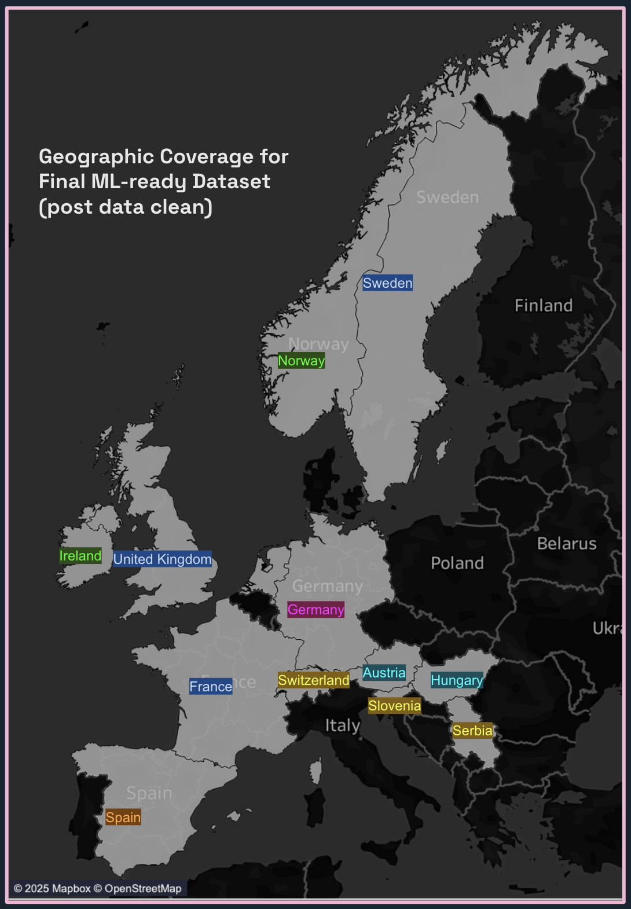  
***FIG. A:***  *Geographic coverage of weather stations after data cleaning, spanning Central and Western Europe.*

---
## Experiment 1: From Rainfall to Rainfall Risk ☔

### Problem Statement

**Data Quality Issues:**  
- Precipitation values inconsistent across stations  
- VALENTIA: Single 90mm spike (valid but extreme outlier)  
- Other stations: Max ~14mm/day (implausibly low for regional norms)  
- No safe scaling possible without significant assumptions  

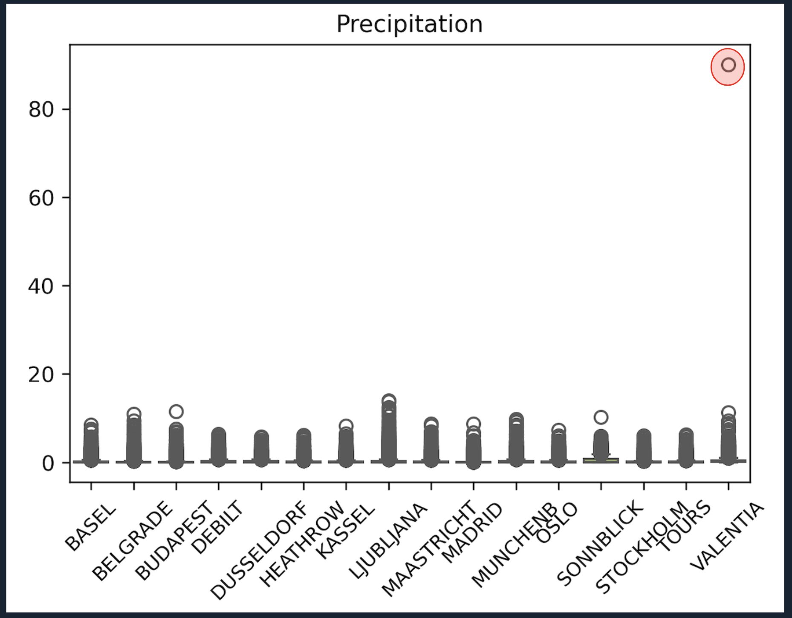  
***FIG. B:***  *Boxplot showing precipitation distribution per station. The extreme outlier at Valentia is highlighted in red, emphasizing measurement variability.*

### Solution: Binary Reframing

**Approach:** Transform precipitation values into a binary target: *"Did it rain tomorrow?"*

**Benefits:**  
- Simplifies the target to a more reliable signal  
- Avoids issues with inconsistent raw measurements  
- Supports actionable risk forecasting  

### Methodology

**ML Preparation Decisions:**  
1. Trimmed date range to 1960–2019 for consistency  
2. Retained stations with imperfect data to:  
   - Simulate real-world missingness and data quality challenges  
   - Test ML’s ability to learn latent proxy patterns  
   - Leverage feature correlations to compensate for gaps  
   - Validate robustness under incomplete data conditions  

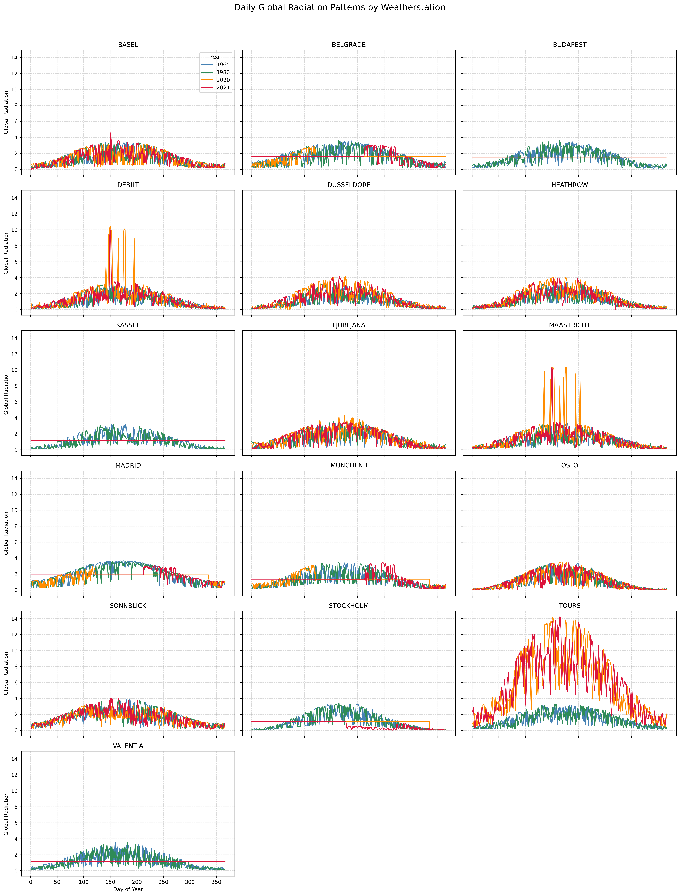  
***FIG. C:***  *Daily global radiation values by station for selected years. From 2020 onwards, many stations show anomalous constant or differently scaled values, prompting truncation of data before 2020.*

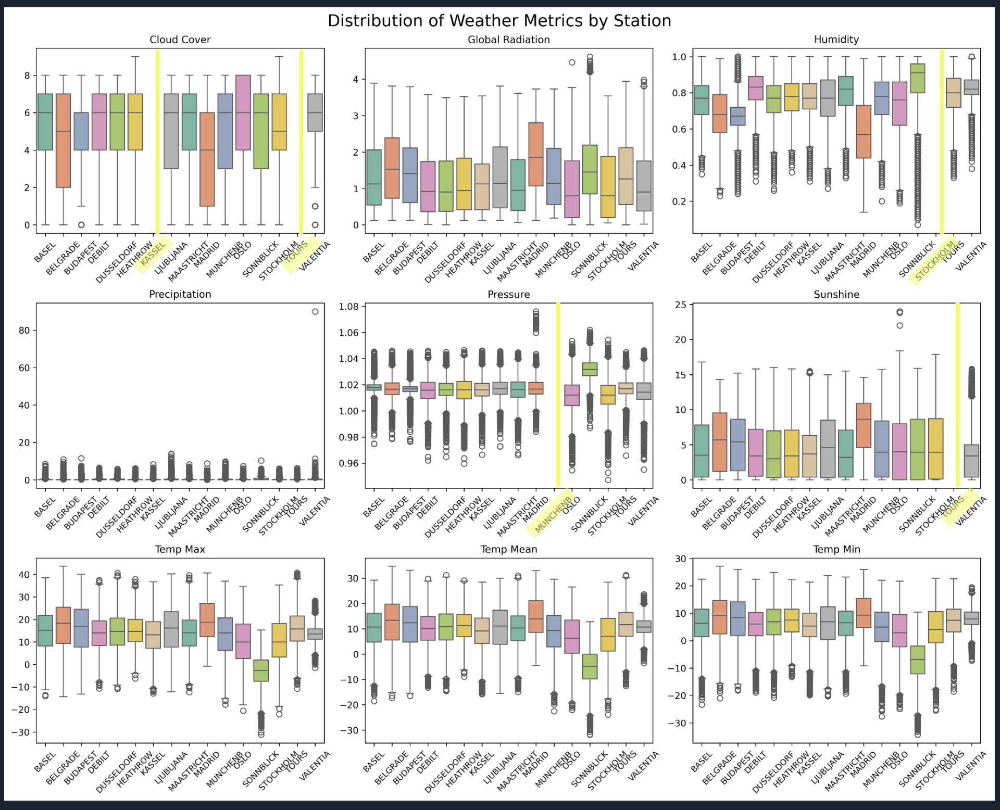  
***FIG. D:***  *Boxplots of variances for various weather metrics per station. Stations missing key values are highlighted in yellow, yet remaining features provide useful signals for ML.*

### Results: Feature Importance Analysis

Random Forest models with randomized search optimization were trained per station, using time-aware splits to prevent leakage.

**Key Findings:**  

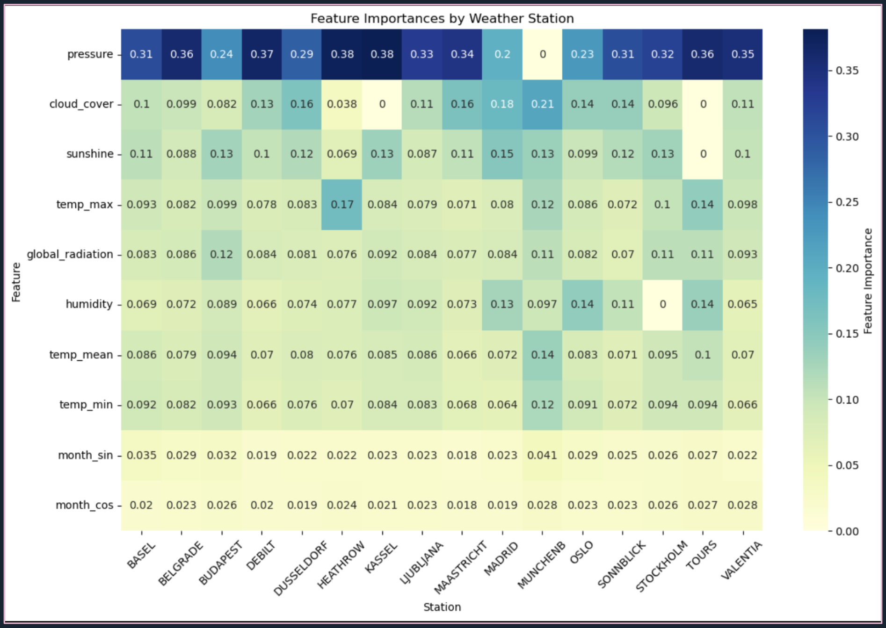  
***FIG. E:***  *Feature importance results from station-specific Random Forests, showing dominant predictors and variation across stations.*

- **Air Pressure**: Top predictor at most stations  
- **Local Variability:** Feature importance patterns vary reflecting local conditions  
- **Coefficient of Variation:** Importance weights between 0.56–1.07 depending on station  

**Adaptive Behavior:**  
- **Kassel:** Missing cloud cover compensated by sunshine data  
- **Tours:** Lacking cloud cover and sunshine, depends on max temperature and humidity  

### Performance Overview

**Results:** Macro F1 score approximately 0.65 with narrow interquartile range

**Insights:**  
- **Consistent performance** despite input inconsistencies  
- **Outliers:**  
  - *MUNCHENB* performed poorly, likely due to missing pressure data  
  - *BUDAPEST* showed poor results, despite complete features  

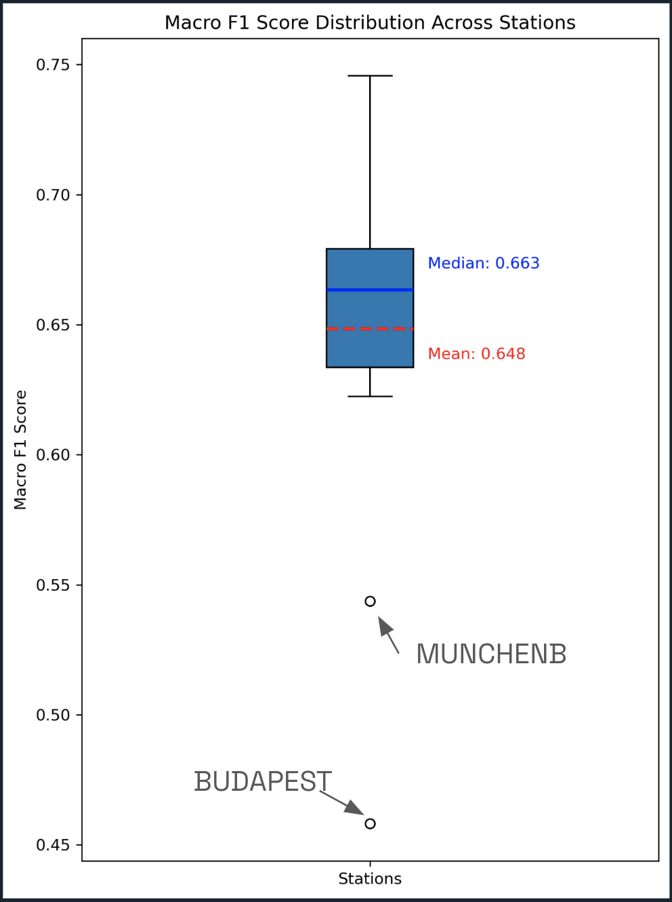  
***FIG. F:***  *Boxplot of Macro F1 scores per station demonstrating consistent predictive performance with some outliers.*

**Conclusion:** Station-specific models can handle heterogeneous data; ML successfully predicts rain likelihood despite noisy inputs.

---

## Experiment 2: Derived Drift 📈

### Motivation

BUDAPEST’s poor model performance prompted exploration of potential climate drift affecting predictability.

### Step 1: Distribution Check

**Method:** Analysis of rainy day counts to evaluate class balance and detect distributional shifts.

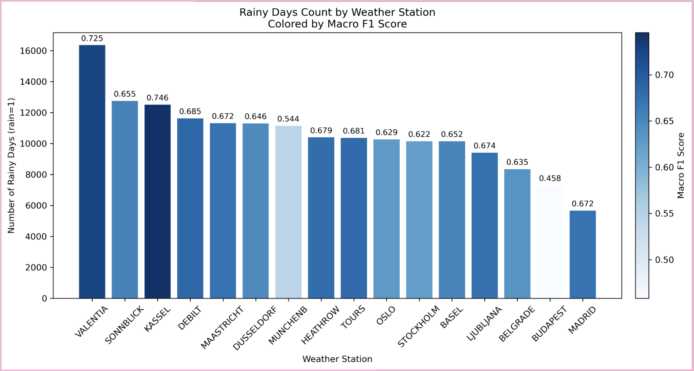  
***FIG. G:***  *Stations ranked by rainy day counts (bars) and colored by Macro F1 score, showing correlation between rain frequency and model accuracy.*

**Findings:**  
- VALENTIA and KASSEL: High rain counts and strong model scores  
- MADRID: Lowest rain count but unexpectedly strong performance due to class imbalance effects  
- SONNBLICK: High rain count but average F1  
- BUDAPEST: Low rain with lowest Macro F1, suggesting alternate failure cause  

### Step 2: Temporal Distribution Analysis

**Results:**  
- KASSEL & VALENTIA test sets exhibit spikes with months having >28 rainy days, absent from training sets  
- SONNBLICK’s training and test rain distributions remained aligned  

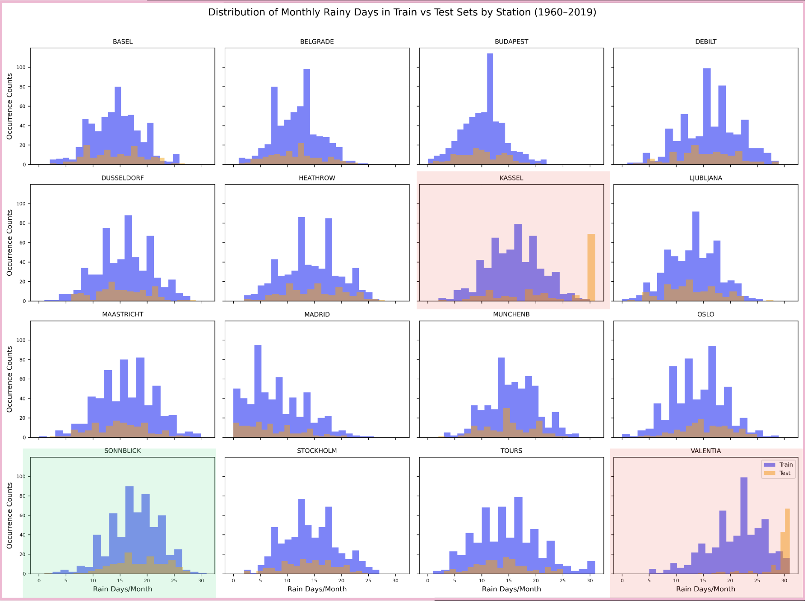  
***FIG. H:***  *Rain day count distribution for train vs. test, highlighting drift for KASSEL and VALENTIA (red) compared with stable SONNBLICK (green).*

**BUDAPEST insight:** Training period concentrated around 12–13 days rain/month spike disappears in test (2007–2019), suggesting climate drift.

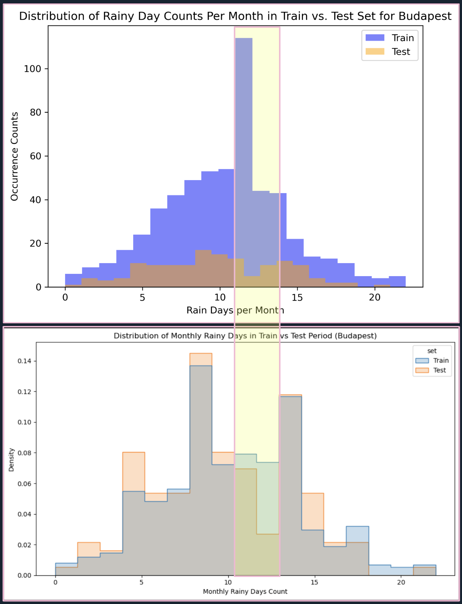  
***FIG. I:***  *Rainy day counts for Budapest showing sharp decline in 10-13 rainy days/month in holdout test set (top: raw counts; bottom: normalized density).*

### Step 3: Smoothed Predictor Testing

**Method:** Applied rolling averages and momentum features to smooth predictors and test sensitivity to drift.

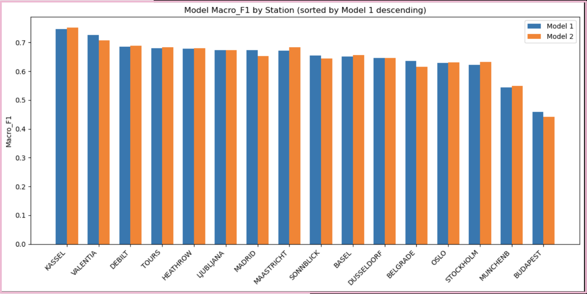  
***FIG. J:***  *Station performance comparison between baseline model (model 1) and smoothed model (model 2). Minor changes noted, with slight accuracy improvement from 65.2% to 65.7%.*

### Step 4: Limitations & Future Directions

**Current Limitations:**  
- K-Means clustering failed to reveal clear regional climate drift groups  
- Rain rate delta as proxy misses seasonality and meteorological context  
- Madrid example shows smoothing may obscure edge signals  

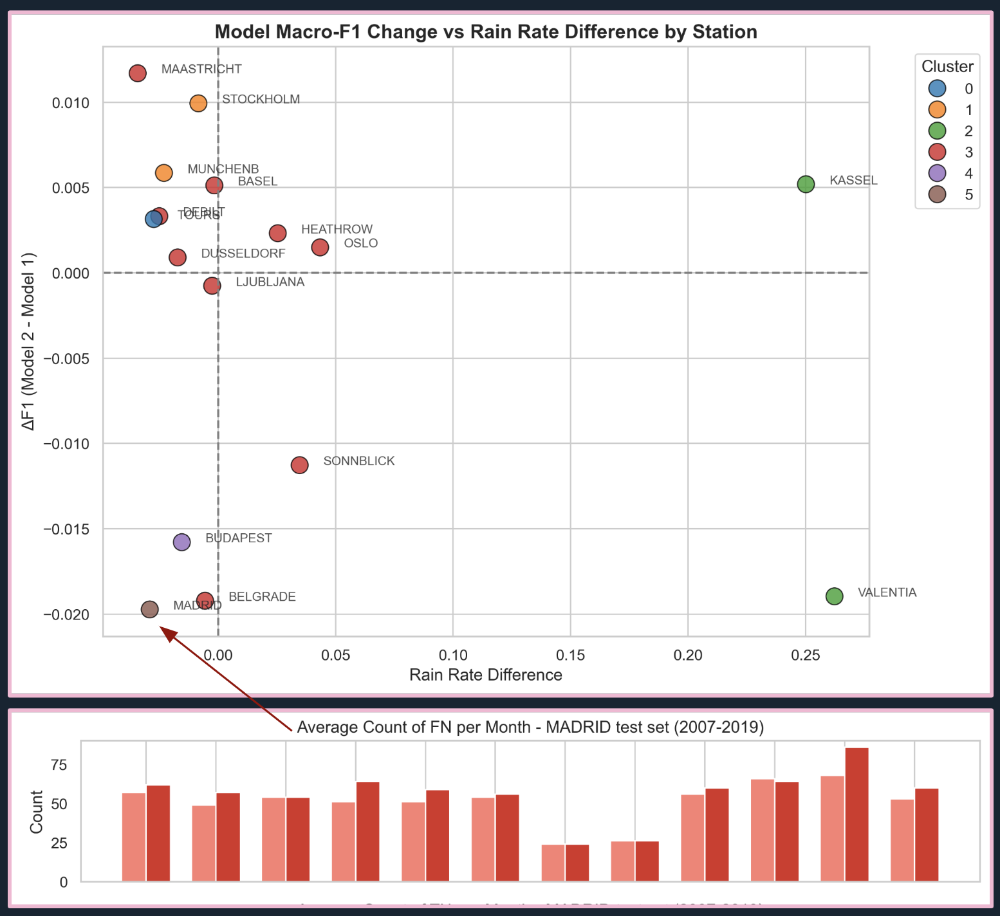  
***FIG. K:***  *K-Means clustering results show no discernible climate drift groups. Zoom into Madrid’s false negatives reveals increased missed rainy days when using smoothed predictors.*

**Next Steps:**  
- Monitor probabilistic prediction residuals for drift  
- Use unsupervised methods (e.g., Isolation Forest) on feature spaces  
- Develop multi-factor drift indices for better sensitivity  

---

## Experiment 3: Munich "Proxycraft" 🔧

### Problem

Munich station severely underperformed (Macro F1: 54.4%) due to missing pressure readings—the globally most important rain predictor.

### Solution: Feature-Based Proxy Modeling

**Approach:**  
1. Trained nonlinear regression model on stations with full features  
2. Learned relationships to predict pressure from available data  
3. Synthesized pressure values for Munich  
4. Re-ran Random Forest model with reconstructed pressure  

### Results

**Performance Improvement:**  
- Before proxy modeling: Macro F1 = 54.4%  
- After proxy modeling: Macro F1 = 63.6%  
- Munich’s performance lined up with global average  

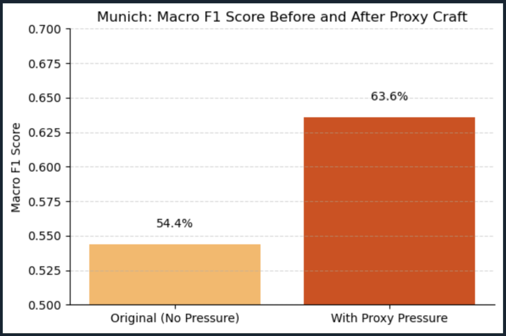  
***FIG. L:***  *Performance improvement for Munich after proxy modeling of pressure, highlighting substantial F1 score gain.*

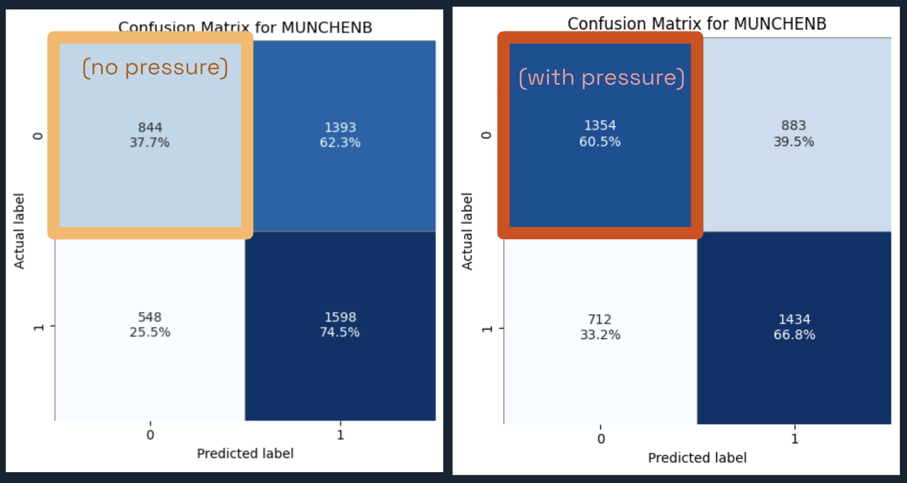  
***FIG. M:***  *Confusion matrix comparison shows Munich’s True Negative rate improvement from 37.7% to 60.5%. True Positives dip slightly but reflect better class separation.*

**Key Insight:** Feature-based proxy modeling outperforms geographic clustering for missing sensor data reconstruction.

---

## Technical Innovations

### 1. Binary Target Transformation  
Converting messy precipitation measures to reliable binary rain risk predictions for robust modeling.

### 2. Climate Drift Detection Framework  
Using time-aware validation and derived features to detect temporal shifts as climate signals rather than errors.

### 3. Meteorological Proxy Modeling  
Learning meteorological relationships to reconstruct missing data with improved scientific validity and scalability.

---

## Final Recommendations

### 🌍 1. From Rainfall to Rainfall Risk  
Employ binary station-level models to predict rain occurrence, not volume — enabling robust, localized risk forecasts despite measurement inconsistency.

### 🌍 2. Detecting Drift, Not Just Decay  
- Use derived features with time-aware validation to reveal instability  
- Create multi-factor drift indices and unsupervised detectors to identify shifting climate signals  
- **Key Insight:** Model deterioration may flag fastest-changing climates, guiding data collection and intervention prioritization.

### 🌍 3. Proxy with Purpose  
- Use feature-based proxy modeling instead of geographic assumptions for missing data reconstruction  
- Favor meteorological relationships, particularly for critical variables like pressure  
- Scalable to other sensor gaps and variable reconstructions  

---

## Strategic Impact for ClimateWins

**Operational Advantages:**  
- Risk-based forecasts more actionable than raw precipitation estimates  
- Models robust to imperfect legacy datasets  
- Systematic missing data reconstruction pipeline  
- Climate signal detection from model drift insights  

**Future Applications:**  
- Early warning systems for extreme weather events  
- Regional climate monitoring and targeted interventions  
- Sensor network design optimized by proxy model performance  
- Long-term climate trend validation through drift detection  

---

**Tools Used:** Python, Random Forest, Feature Engineering, Time Series Analysis, Proxy Modeling  
**Skills Demonstrated:** Advanced ML pipeline design, climate data science, missing data imputation, temporal validation, scientific problem reframing  
