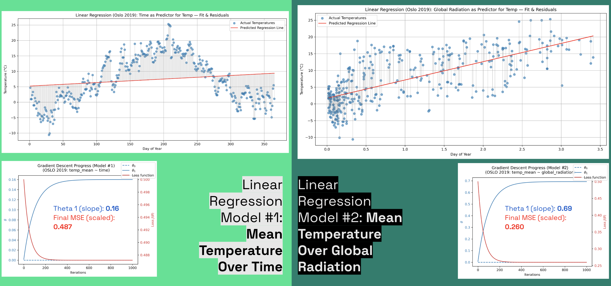

# ClimateWins: Weather Conditions & Climate Change Analysis 🌍

**Project Date:** June 2025  
**Category:** Machine Learning & Climate Science  
**Project Type:** Interim Research Report

## Project Overview

**Objective:** Assess machine learning tools for enabling ClimateWins, a non-profit, to predict climate change impacts—beginning with the categorization of mainland Europe weather data.

**Data Source:** European Climate Assessment & Data Set Project (ECA&D)
- **Date Range:** 1960-2022 (62 years of daily observations)
- **Coverage:** 18 weather stations across mainland Europe
- **Provenance:** Public initiative established in 1998 by EUMETNET with European Commission support

**Research Structure:**
1. **Data Provenance & Ethical Considerations**
2. **Machine Learning Foundations & Hypotheses**
3. **Preliminary ML Model Evaluations**

**Deliverables:**  
- [GitHub Repo](https://github.com/amyzhang-commits/climatewins_1_ML_intro)  

---

## TL;DR

- We applied machine learning to classify daily weather as “pleasant” vs. “unpleasant” using European climate data.  
- A data audit surfaced gaps in geographic representation, feature completeness, and subjective label construction—each impacting fairness and generalizability.  
- Despite limitations, interpretable models like Decision Trees and basic MLPs achieved high performance—suggesting learnable patterns even from sparse features.  
- However, **ethical and structural flaws in the dataset are as critical as model accuracy**—especially under conditions of accelerating climate drift.

**Recommendation:** Start with interpretable models for trust and transparency, but prioritize improved data sourcing, clearer labeling protocols, and techniques that account for shifting climate baselines.

---

## I. Data Provenance: Ethical Considerations & Data Integrity

### Dataset Overview
- **Full Weather Dataset:** Daily records across 18 stations with comprehensive weather metrics
- **Pleasant Weather Subset:** Binary classification dataset (1 = Pleasant, 0 = Unpleasant)

***FIG. A:*** *Reverse-engineered entity-relationship diagram showing weather metrics (in blue) used to construct derived variables like “pleasantness.”*

### Critical Bias Identification

#### #1: Geographic Coverage Bias
**Problem:** Tours (France), Roma (Italy), and Gdansk (Poland) excluded from "pleasant weather" subset—each was the only station representing its country.

**Impact:** 
- Spain now the sole warm-climate representative
- Germany has 3 stations, Netherlands has 2
- Geographic gaps risk model overfitting to well-sampled regions

***FIG. B:***  *Countries excluded from the "pleasant weather" subset are shaded yellow. Symbols represent the number of weather stations per country; Germany and the Netherlands are disproportionately represented. This may not be problematic, as micro-climates don’t follow political boundaries. However, it highlights structural inequities: weather data tends to overrepresent areas with robust data infrastructure (primarily the Global North) and underrepresent vulnerable regions like the Global South and small island nations. This bias is important to consider if ClimateWins expands beyond the global north.*

#### #2: Feature Completeness Bias
**Problem:** Only 7 of 18 stations record snow depth; only Basel, Düsseldorf, and Oslo have complete weather records.

***FIG. C:*** *Heatmap showing missing metric values per station. Where data is absent, entire features are missing—this forces the exclusion of complex weather dimensions during model training.*

**Impact:** Incomplete features often dropped for ML compatibility, leading to potential overrepresentation of simple weather profiles over complex/volatile contexts where relationships between diverse variables are more nuances and rely on granular shifts. 

#### #3: Subjectivity in Labeling
**Examples:**
- Sonnblick (Austria): 0 "pleasant" days
- Madrid (Spain): ~50/50 split, average pleasantness ~45%

***FIG. D:*** *Ranked bar chart showing proportion of "pleasant" days per country. Binary labels embed assumptions about comfort—risking the encoding of subjective cultural, regional, or climatic norms.*

**Impact:** Boolean labels encode narrow thresholds reflecting implicit normative assumptions about comfort, potentially shaping downstream model behavior and resource allocation decisions.

---

## II. Machine Learning Foundations & Hypotheses

### Hypothesis #1: Unlocking Emergent Patterns with ML
**Traditional Analysis Limitation:** Shows broad seasonal trends but short-term fluctuations often defy visual explanation.

***FIG. E:***  *Traditional analysis shows broad seasonal trends. But short-term fluctuations—intra-annual “spikes and dips”—often defy visual explanation.*

**ML Hypothesis:** The deeper interplay of predictive factors can enrich time-based models: ML can analyze complex, nonlinear relationships to identify subtler climate dynamics beyond visual patterns. 

### Hypothesis #2: Weather as Web – Tapping Feature Interdependencies
**Identified Relationships:**
- ☁️ Humidity ↔ Cloud Cover ↔ Precipitation
- ☀️ Radiation ↔ Sunshine ↔ Temperature

***FIG. F:*** *Correlation matrix highlighting key interdependencies. These feature clusters can be treated as composite signals for enhanced forecasting power.*

---

**ML Hypothesis:** ML models can leverage correlated feature clusters as composite predictors, achieving more robust, context-aware forecasts.

### Hypothesis #3: The Challenge of Temporal Drift in Weather Dynamics

***FIG. G:*** *Boxplots (station-month-year level) reveal shifts in variable distributions—suggesting temporal drift and the emergence of new climate “normals.”*

**Observation:** Color-coded outliers reveal emerging "new normals"—rising temperatures and reduced snowfall make older data points increasingly appear as outliers.

**ML Hypothesis:** ML models trained on historical climate data may underperform as key variables drift over time, reducing predictive accuracy.  

---

## III. Preliminary ML Model Evaluations

### Models Tested
- 📈 **Linear Regression:** (Univariate models with gradient descent)
- 🤖 **ANN:** Artificial Neural Network (Logistic Regression & Multi-Layer Perceptron)
- 📍 **KNN:** K-Nearest Neighbor  
- 🌳 **Decision Tree:** (Greedy vs. gradient-based optimization)

### Linear Regression Analysis: OSLO 2019

**Note:** This Linear Regression section serves as a pedagogical sandbox demo, designed to show how a model iteratively adjusts itself to minimize error. OSLO was chosen due to its complete weather metric dataset.

**Model Comparison:**

1. **Temperature vs. Time:** θ₁ = 0.16, Final MSE = 0.487  
2. **Temperature vs. Global Radiation:** θ₁ = 0.69, Final MSE = 0.260

**Key Insight:**  
Global radiation has a stronger linear relationship with temperature, providing a more informative gradient landscape for optimization.

  
***FIG. H:***  *Comparison of Actual vs. Predicted values for two univariate linear regression models: Time vs. Global Radiation as independent variables.*

  
***FIG. I:***  *Surface plot analysis: We see with **Model 1 (Time), a shorter, misaligned trajectory indicating a flatter, noisier surface with weaker gradient signals. **Model 2 (Radiation)** exhibits a longer, curved path reflecting a directional loss surface with strong gradients guiding toward the minimum.*

**Takeaway:**  
Linear regression, while basic and limited in modeling non-linear real-world relationships, offers a powerful way to visualize the loss landscape and observe step-by-step model adjustments. Additionally, such models can be enhanced through feature engineering or combined in ensembles to improve performance.

---

### Next: Categorical Modeling of Weather Pleasantness

The following three classification models address ClimateWins' interest in the pleasantness dataset. Unlike regression, the output here is categorical (predicting "pleasant" or "unpleasant"), not a continuous variable. To support this, we expand the ML dataset for OSLO to cover all available years.

---

### Classification Results

#### 🤖 Artificial Neural Network

**Architectures Tested:**
- **Logistic Regression** (Single-layer Perceptron)
- **Multi-Layer Perceptron (MLP)**

We compared a basic logistic regression (the simplest ANN, or single-layer perceptron) and a deeper MLP with two hidden layers (12 and 8 neurons). The MLP was trained with backpropagation and the Adam optimizer for adaptive learning rates.

**Performance Comparison:**  
- Logistic regression applies a sigmoid activation to the weighted sum of all inputs, yielding probabilities between 0 and 1.
- The MLP, with its deeper architecture, saw a persistent gap between training and validation accuracy up to epoch 40, suggesting initial generalization challenges.
- However, MLP starts and ends higher than LR throughout in validation accuracy. 

**Result:**  
*The MLP consistently outperformed logistic regression in both starting performance and ability to generalize.*

  
***FIG. J:*** *ANN model performance comparison. Blue: Logistic Regression. Orange: Multi-Layer Perceptron (MLP) with two hidden layers. MLP achieves higher validation accuracy than logistic regression.*

#### 📍 K-Nearest Neighbor (KNN)

**Performance:**  
- Achieved 96% accuracy on unseen data with optimal K = 8.

**Precision & Recall:**  
- **Unpleasant class:** 98% precision, 97% recall  
- **Pleasant class:** 85% precision, 91% recall

We used KNN—an instance-based, non-inductive model that predicts classes by comparing proximity in feature space. The best number of neighbors (K) was determined using 5-Fold Cross-Validation on the training set.

  
***FIG. K:*** *Cross-validation results for KNN model. The optimal number of neighbors (K) is identified via 5-Fold Cross-Validation.*

The model exhibits strong class-specific performance:  
- For "unpleasant" days, KNN provides very high precision (97% of predicted unpleasant days are correct).
- For "pleasant" days, performance is robust, though slightly lower—likely due to the greater frequency of "unpleasant" labels, an effect of class imbalance in the dataset.

  
***FIG. L:*** *KNN confusion matrix. High precision for the unpleasant class (97.0%) and reliable accuracy for the pleasant class (91.5%). Some performance asymmetry reflects underlying class imbalance.*

#### 🌳 Decision Tree

**Performance:**  
Achieved perfect accuracy and recall on the validation set.

The Decision Tree model works by starting at a root node with a yes/no question and branching down through successive splits based on feature values, ultimately reaching leaf nodes that assign class labels. While very interpretable, decision trees are prone to overfitting since each split optimizes locally rather than globally.

In this case, however, an audit confirmed that the Decision Tree’s classification rules exactly match the original labels, indicating that the dataset is fully separable and the perfect metrics are due to dataset simplicity rather than overfitting.

  
***FIG. M:*** *Decision Tree confusion matrix showing perfect classification performance.*

  
***FIG. N:*** *Visualization of decision tree splits. The audit (right) shows the tree has essentially reverse-engineered the original threshold rules, explaining the perfect precision and recall.*

---

## Model Recommendations & Analysis

### 1. 🌳 Decision Tree (Recommended)
**Strengths:**
- Perfect accuracy and recall for this dataset
- Ideal for deterministic, rule-based data
- High interpretability

**Caveat:** Future data might be less clean—need clearer "pleasant weather" definitions

### 2. 🤖 Multi-Layer Perceptron ANN (Future-Ready)
**Strengths:**
- Strong performance across all metrics
- Better suited for complex, real-world patterns
- Capacity for nonlinear relationships

**Trade-off:** Higher computational cost but manageable

### 3. 📍 KNN (Solid Baseline)
**Strengths:**
- Solid accuracy and recall
- Instance-based approach

**Limitations:**
- Non-inductive nature limits adaptability
- May struggle with data drift common in weather data

### 4. 🤖 Logistic Regression ANN (Prototype-Friendly)
**Strengths:**
- Lowest computational cost
- Simple architecture
- Good for fast prototyping

**Limitations:** May require hyperparameter tuning for performance improvements

---

## Final Recommendations

### 1. Model Selection
**Choose Decision Tree (🌳)** for current task and dataset—combines accuracy with interpretability.

### 2. Bias Mitigation
**Subset data by region** to address geographic and feature biases while handling subjective "pleasantness" definitions.

### 3. Future Expansion Strategy
- Develop more nuanced "pleasantness" criteria
- Broaden dataset coverage
- Explore flexible models like MLP when complexity grows

---

## Technical Contributions

**Methodological Innovations:**
- Comprehensive bias audit of climate datasets
- Multi-dimensional model comparison framework
- Integration of ethical considerations into ML pipeline
- Gradient descent visualization for feature selection validation

**Skills Demonstrated:** Machine Learning Pipeline Development, Ethical AI Assessment, Climate Data Analysis, Model Interpretation, Bias Detection

---

**Tools Used:** Python, Machine Learning (ANN, KNN, Decision Trees, Linear Regression), Data Visualization  
**Domain Impact:** Climate Science, Non-Profit Strategy, Environmental Policy
