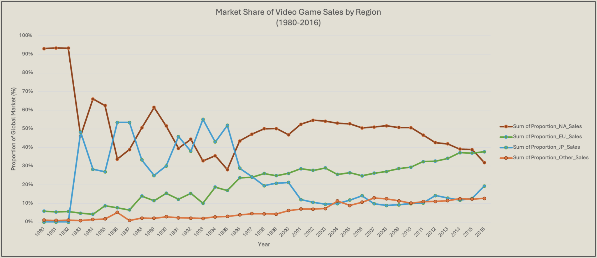
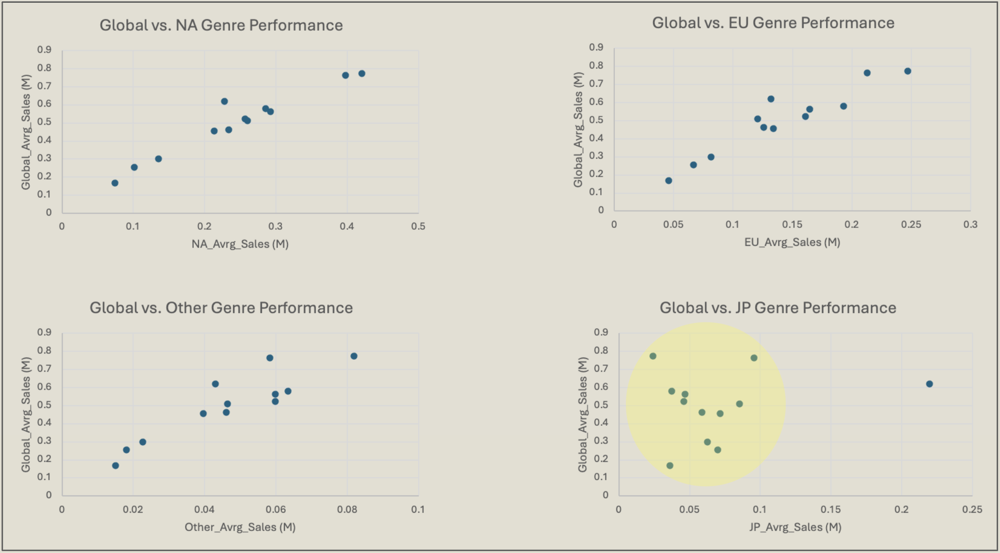
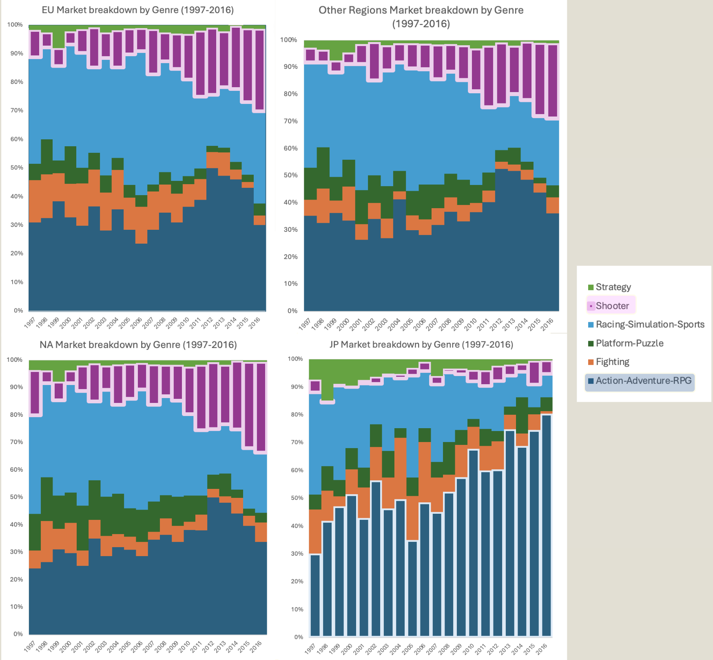
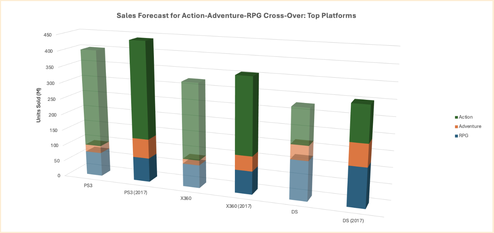

# GameCo Regional Marketing Strategy 🎮

**Project Date:** September 2024  
**Category:** Business Intelligence  

## Project Overview

**Objective:** Identify the best regions for launching new games in 2017 using historical sales data.

**Data:** VGChartz dataset — global video game sales (1980-2016) for titles that sold over 10,000 units.

**Methods:**
- Filtered and organized data using Excel (grouping, sorting, cleaning)
- Conducted descriptive analysis to highlight trends
- Created visualizations to communicate key insights

---
## TL;DR

- GameCo’s global sales have declined since 2008, despite regional market growth in the EU and Other regions.  
- Japan displays unique genre preferences that diverge from global trends.  
- Shooter games are rising globally, while Japan sees increasing popularity in Action-Adventure-RPG titles.  
- Cross-genre strategies show promise but require deeper behavioral data to validate.  

**Recommendation:** Focus marketing efforts in the EU and Other regions, explore genre-targeted strategies in Japan, and pursue genre blending only with more robust consumer behavior data.

---

## Key Insights

### 1. Regional Market Share Evolution (1980-2016)

EU and Other regions show consistent growth since 1980, while Japan and the US have mirrored volatility in market share.

**⚠️ Critical Finding:** Despite certain regional gains, GameCo's gross sales have been declining since 2008.

  
***FIG. A:*** *Longitudinal view of market share by region. Note GameCo's declining global sales post-2008.*

### 2. Regional Genre Preferences (1980-2016)

All regions show similar trends, apart from Japan. Distinct genre preferences can inform targeted marketing strategies.

  
***FIG. B:*** *Scatterplots compare each region’s average sales to global genre averages. NA, EU, and Other closely mirror global trends; Japan’s genre preferences diverge significantly.*

**Key Observation:** Japan demonstrates unique genre preferences that diverge from global patterns.

### 3. Emerging Genre Trends

**Shooter Games:** ⬆️ Rising globally on aggregate  
**Action-Adventure-RPG:** ⬆️ Rising specifically in Japan, despite global decline

  
***FIG. C:*** *Genre breakdown by region. Japan skews toward Action-Adventure-RPGs; global markets favor Shooters.*

---

## Bonus: Exploratory Analysis Attempt

### Marketing Opportunity: Combining Genres

**Challenge Explored:** Customer crossover analysis with static sales data

**Ethical Consideration:** Hesitated to highlight Shooter genre growth due to concerns about promoting violent content.

**Approach:** Attempted to reallocate genre popularity using historical platform sales to suggest genre fusion strategies.

**Hypothesis:** Blending genres could drive sales through consumer crossover.

  
***FIG. D:*** *Simulated impact of genre crossover (e.g., Action-Adventure-RPG) on sales, based on platform-level trends.*

**Limitations Identified:**
- Flawed assumption that sales trends would continue
- Assumed genres/platforms were interchangeable
- Needed transactional/basket data to support segmentation

**Key Takeaway:** Future analysis requires transaction-level data to explore basket diversity, segment customers more rigorously, and treat genre preference as a clustering or sequence modeling problem rather than relying on averages alone.

---

## Recommendations

### 1. Increase Marketing Investment in Growth Regions
Focus marketing investment in the EU and 'Other' regions, given their consistent growth trajectory.

### 2. Investigate Japan-Specific Opportunities
The region's unique genre preferences present a strategic opportunity requiring deeper investigation.

### 3. Tailor Game Marketing by Region
- **Global Strategy:** Promote top shooters worldwide
- **Japan Focus:** Emphasize action-adventure-RPGs and select shooters
- **Outside Japan:** Leverage racing/simulation/sports growth trends

---

**Tools Used:** Excel, Data Visualization  
**Skills Demonstrated:** Market Analysis, Trend Identification, Strategic Recommendations
