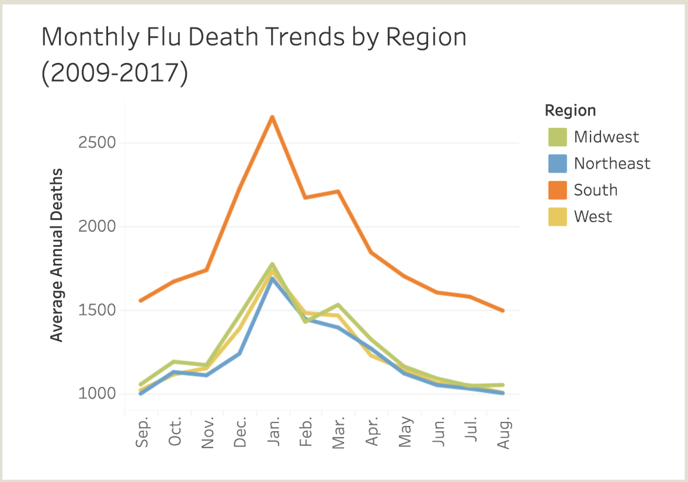
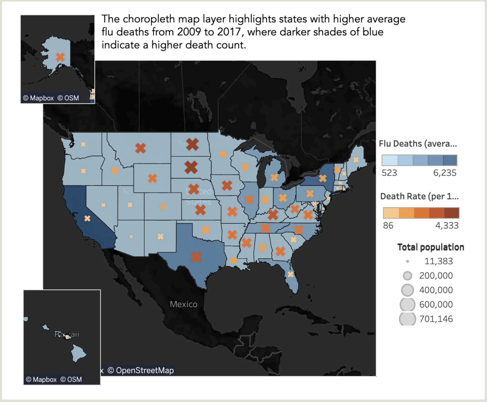

# Influenza Patterns in the U.S. (2009–2017): Preparing for Flu Season 💉🏥

**Project Date:** November 2024  
**Category:** Public Policy & Infrastructure  

## Project Overview

**Objective:** Identify high-impact regions and time periods for vaccination and staffing campaigns by analyzing historical flu mortality trends.

**Why it matters:**  
Flu response planning often defaults to uniform approaches. By uncovering regional and demographic patterns, we can target interventions more effectively — improving outcomes for vulnerable populations and easing strain on healthcare systems.

**Data Sources:**  
- CDC Influenza Mortality Data (2009–2017)  
- U.S. Census Population Estimates (2009–2017)

**Methods:**  
- Data cleaning, integration, and normalization  
- Correlation and regional trend analysis  
- Tableau dashboards for visual forecasting  
- Narrative design for policy and decision support  

**Deliverables:**  
- [Tableau Dashboard: Version 1](https://public.tableau.com/views/2_9_InfluenzaPrep/Story3?:language=en-US&:sid=&:redirect=auth&:display_count=n&:origin=viz_share_link)  
- [Tableau Dashboard: Version 2](https://public.tableau.com/views/2_10INFLUENZAPREP_4/Story1?:language=en-US&:sid=&:redirect=auth&:display_count=n&:origin=viz_share_link)  
- [YouTube Walkthrough](https://youtu.be/livbDXP7FJI)

---

## TL;DR

- Flu deaths follow strong seasonal patterns with intensified regional concentration in the U.S. South.  
- Adults 65+ make up only 10% of the population but account for nearly two-thirds of flu deaths.  
- When normalized per capita, the ranking of high-risk states shifts dramatically — underscoring that vulnerability is not the same as risk exposure.  
- A custom severity index (FSPI) and residual-based clustering revealed hints of systemic variation in how states absorb flu burden.

**Recommendation:**  
Shift from broad strategies to **contextualized response plans** — factoring in population risk *and* healthcare system capacity.

---

## Key Insights

### 1. Regional & Seasonal Patterns

**Seasonality:**  
- Flu season peaks in winter, with occasional spring resurgence  
- The Southern U.S. consistently shows the highest mortality rates

  
***FIG. A:*** *Average monthly flu deaths by U.S. region.*  
**Note:** Y-axis scaling may exaggerate differences—consider when interpreting.

---

### 2. Age-Related Vulnerability

**Critical Insight:** Adults 65+ represent ~10% of the population but account for ~66% of flu fatalities.

  
***FIG. B:*** *Population age distribution (left) vs. flu mortality age distribution (right).*

**Geographic Impact:** States with larger senior populations show higher total flu deaths, highlighting a demographic risk layer.

  
***FIG. C:*** *Scatterplot showing correlation between 65+ population and total flu deaths.*

---

### 3. Population-Normalized Risk Analysis

**Key Insight:** High total death counts ≠ high individual risk.

**Example:**  
California leads in total deaths but ranks low in flu deaths per 100K residents when adjusted for population.

  
***FIG. D:*** *Choropleth of flu deaths per capita (shading), with symbol size showing total deaths. High population states like California appear lower-risk when normalized by population.*

**Implication:** Effective resource allocation must weigh both absolute numbers and population-adjusted risk.

---

## Bonus: Exploratory Modeling

### 1. Flu Severity Parsing Index (FSPI)

**What It Is:**  
A custom metric to flag states where flu deaths among seniors (65+) are disproportionately high relative to overall mortality.

**Formula:**  
`FSPI = Death rate (65+) ÷ Overall death rate`

**Why It Matters:**  
In a typical system, seniors face higher risk—but extreme ratios may signal systemic strain, delayed care, or underserved populations.

**How It Was Used:**
- Mapped FSPI vs. 65+ death rate
- Analyzed residuals to flag overperformance or underperformance

**Examples:**
- **Alaska** shows the highest FSPI—indicating potential system strain  
- **Florida** has high death counts but a low residual—suggesting stronger-than-expected performance

  
***FIG. E:*** *Scatterplot of FSPI vs. 65+ death rate. Alaska, Florida, and California stand out—but for different reasons.*  

> **Note:** FSPI is a hypothesis-generation tool—not a forecast model. Based on 9 years of data per state.

---

### 2. Query Clusters

**Approach:**  
Manual clustering in 2D feature space for interpretability.

**Methodology:**  
- Plot FSPI vs. residual  
- Size points by population  
- Surface cross-regional groupings (e.g., high-density metro vs. rural profiles)

**Innovation:** Enables "informed random sampling"—a more nuanced alternative to basic geographic grouping.

  
***FIG. F:*** *Average FSPI vs. Residual, sized by state population. Visual clusters suggest different structural profiles across states.*

---

## Recommendations

### 1. Synchronize National Vaccination Campaigns  
Align campaign intensity with deaths per 100K residents. Prioritize the Southern region, which shows elevated total deaths and sustained monthly mortality.

### 2. Broaden Metrics Beyond Mortality  
Incorporate metrics for hospital strain (e.g., patient volume, surge capacity). Target staffing not just where deaths are highest, but where systems are overwhelmed.

### 3. Refine Vulnerability Models  
Factor in socioeconomic indicators (e.g., insurance coverage, income levels) alongside age. This enables a more equitable and effective resource allocation model.

---

**Tools Used:** Tableau, Python, Data Integration  
**Skills Demonstrated:** Geospatial Analysis, Public Health Analytics, Custom Metric Development, Visual Storytelling
