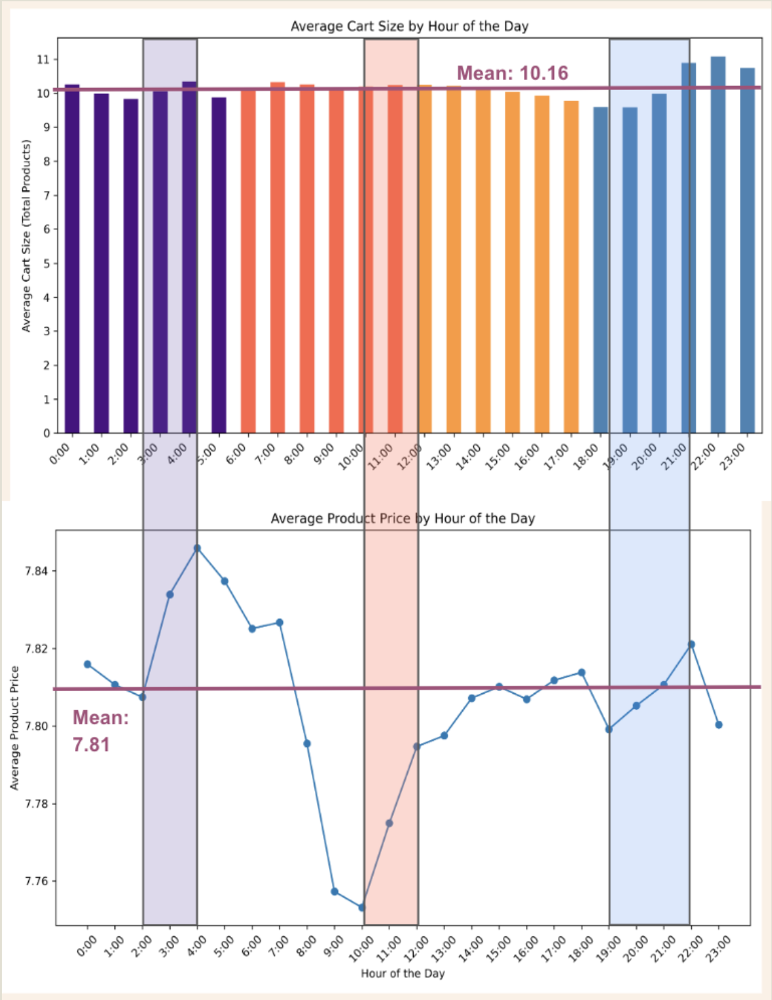
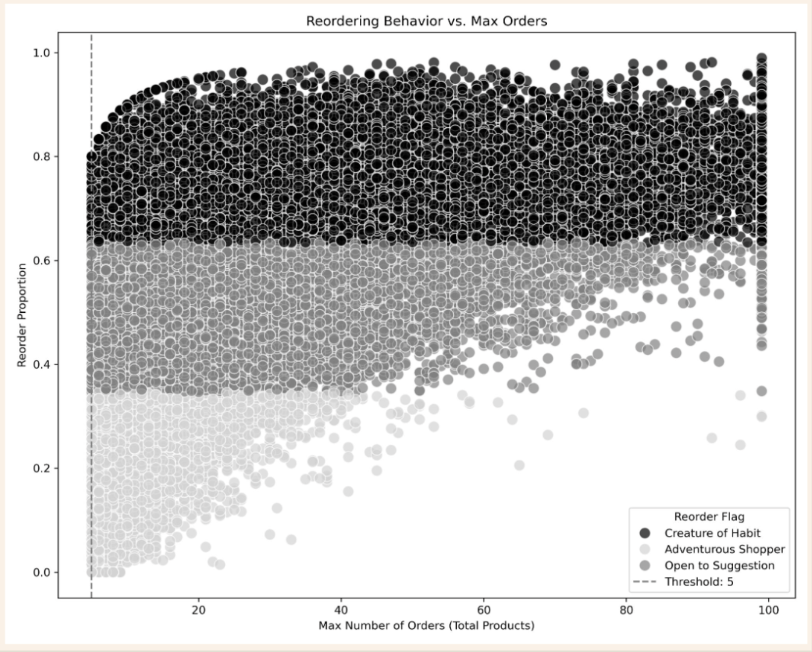
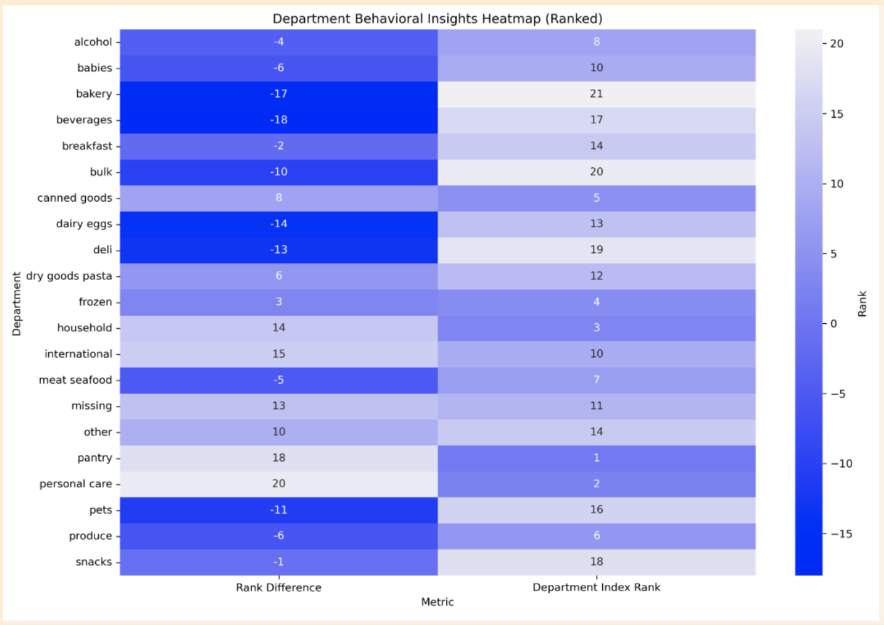

# Instacart Market Basket Analysis 🛒

**Project Date:** January 2025  
**Category:** Business Intelligence  

## Project Overview

**Objective:** Uncover customer behavior patterns and product purchasing trends to support segmentation and marketing efforts.

**Data:** Instacart online shopping dataset (2017), including orders, products, departments, and customer profiles.

**Methods:**
- Python for data cleaning, merging, aggregation, feature engineering, and exploratory visualization

**Deliverables:**
- [GitHub: Python_InstacartAnalysis](link-placeholder)

---
## TL;DR

- Shopper behavior varies sharply by time of day—non-peak hours (early morning, late night) drive higher-value carts than midday.
- Reorder behavior spikes after 40+ orders, signaling a shift from exploration to loyalty; segmenting by reorder patterns reveals distinct shopper types.
- Low-income customers under-purchase staple items, suggesting price sensitivity; snack purchases dominate instead.
- A custom index flags departments with high revenue and low loyalty—ideal for novelty-driven promotion strategies.

**Recommendation:** Time marketing to shopper segments, reward loyalty after key thresholds, address price sensitivity for staple foods, and promote high-revenue/low-reorder departments to drive discovery.

---
## Key Insights

### 1. Time-Based Revenue Patterns

**Key Finding:** Revenue spikes outside 1-2pm driven by distinct shopper segments:
- **Early Birds**
- **Evening Shoppers** 
- **Night Owls**

***FIG. A:***  *Overlaying average cart size and product price by hour reveals key revenue windows—when shoppers are both buying more and spending more. These peak periods help define shopper segments by time of day.*

**Strategic Insight:** These non-peak shopper segments drive growth with larger carts and higher-value items. Timing matters—targeted non-peak hours outperform midday in revenue impact.

### 2. Loyalty & Reorder Behavior

**Critical Threshold:** Reorder rates rise sharply after 40-50 orders.

**Behavioral Shift:** Customers transition from exploration phase to habitual buying patterns.

***FIG. B:***  *Scatterplot shows how reorder rates evolve as customers place more orders. Shopper types—'Creature of Habit', 'Adventurous Shopper', and 'Open to Suggestion'—highlight behavioral thresholds tied to loyalty.*

**Business Impact:** Loyalty builds predictable, high-reorder purchase patterns that can be leveraged for inventory planning and personalized marketing.

### 3. Income-Driven Department Trends

**Methodology:** Department purchases were normalized by the number of users in each demographic group to compare average behavior per person rather than total volume—mitigating proportional scaling bias and producing a behavior-adjusted purchasing matrix.

**Key Patterns:**
- **High/Mid-Income:** Dominant in meat & seafood purchases
- **Low-Income:** Dominant in snack buying
- **Staples (frozen, dairy, pantry):** Under-purchased by low-income groups—indicates possible price sensitivity
- **Beverages:** Consistent purchasing across all income groups

***FIG. C:***  *Heatmap of department-level purchasing, normalized per user, uncovers behavioral trends across income levels—revealing category preferences and price sensitivity that volume-based metrics can miss.*

---

## Bonus: Exploratory Modeling

### Department Opportunity Index (Multifactor)

**Innovation:** Built a custom index ranking departments by revenue potential and customer novelty behavior.

**Objective:** Spotlight departments that are high-revenue yet suggestible to experimentation (low reorder rates, potential for "whim" or trial-driven purchases).

**Index Components:**
- **Average revenue per order** → financial value
- **Reorder rate** → habit/loyalty indicator  
- **Non-reorder rate** → novelty/impulse potential

***FIG. D:*** *Which departments drive revenue—and which are ripe for discovery? This index blends three factors: (1) average revenue per order, (2) reorder rank, and (3) non-reorder rank. A **large positive rank gap** (more non-repeat purchases) flags novelty-driven departments ideal for promotions and product discovery. A **negative gap** highlights habit-driven categories—strong candidates for loyalty and retention strategies.  
**In short:** this index helps prioritize departments that are either:
- High-value and ready for exploration, or  
- Consistent performers that thrive on repeat business.*

**Strategic Application:** Use insights to design growth campaigns targeting underutilized but high-value departments.

**Technical Lessons Learned:**
- Used rank inversion to weight behavioral gaps—complex but powerful approach
- Ranking-based indexes are intuitive for comparison but sensitive to directionality
- Must stay organized when layering multiple metrics
- Future consideration: Explore z-score or percent-based normalization for smoother weighting, though ranks effectively identified "standouts"

---

## Recommendations

### 1. Align Marketing with Shopper Timing
Proactively adjust marketing campaigns to match time-based shopper profiles—**Early Bird, Midday Shopper, Evening Shopper, and Night Owl**—to capture revenue during peak purchasing windows outside traditional midday hours.

### 2. Boost Customer Adventurousness & Loyalty
- **For Non-Reordering Customers:** Target with promotions that encourage product sampling and experimentation
- **For Regular Shoppers:** Use loyalty programs and personalized offers to increase repeat business and build on established purchasing habits

### 3. Address Price Sensitivity for Staple Goods
For high-volume staple items, implement price-sensitive strategies such as lower price points, bulk discounts, and value packs to counter reduced purchases among low-income groups and expand market accessibility.

---

**Tools Used:** Python, Pandas, Data Visualization  
**Skills Demonstrated:** Feature Engineering, Customer Segmentation, Behavioral Analysis, Custom Metric Development
