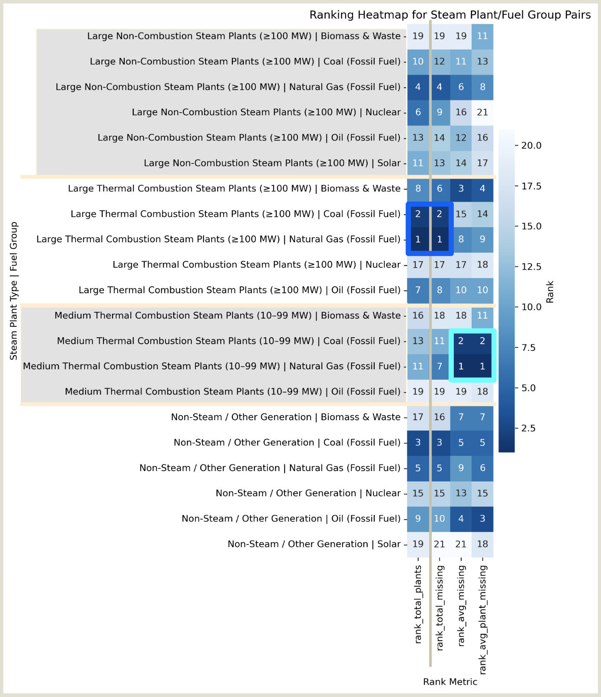
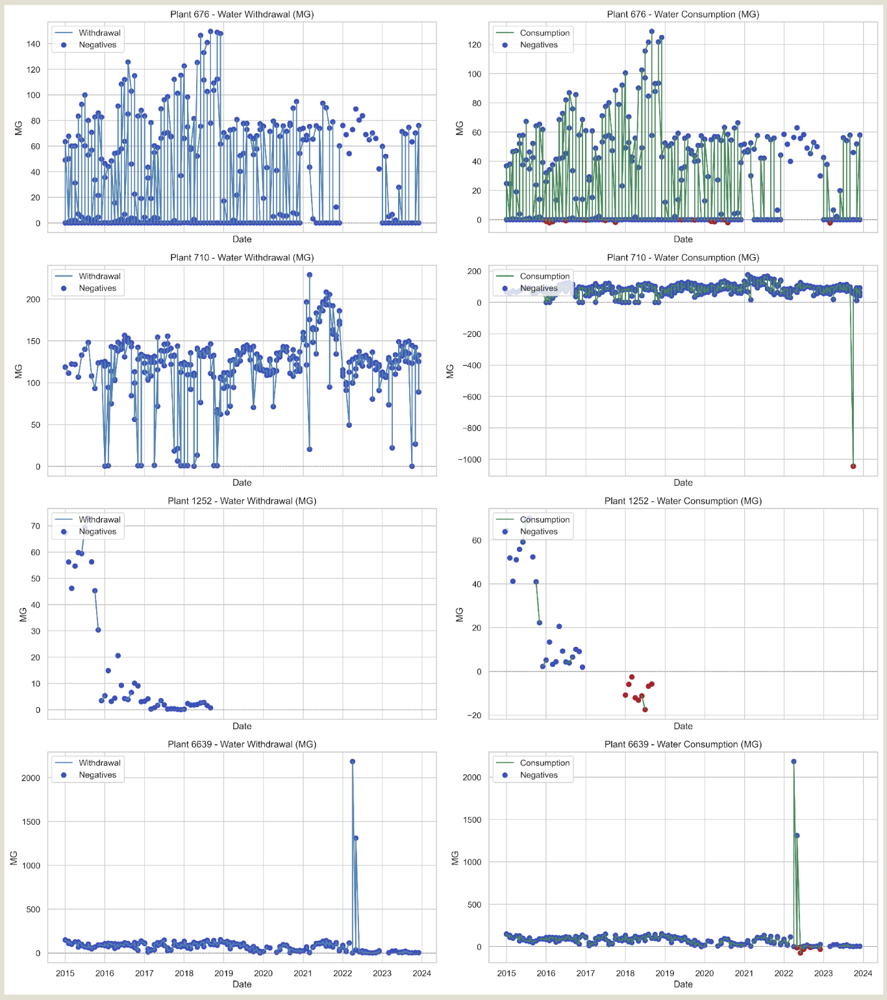
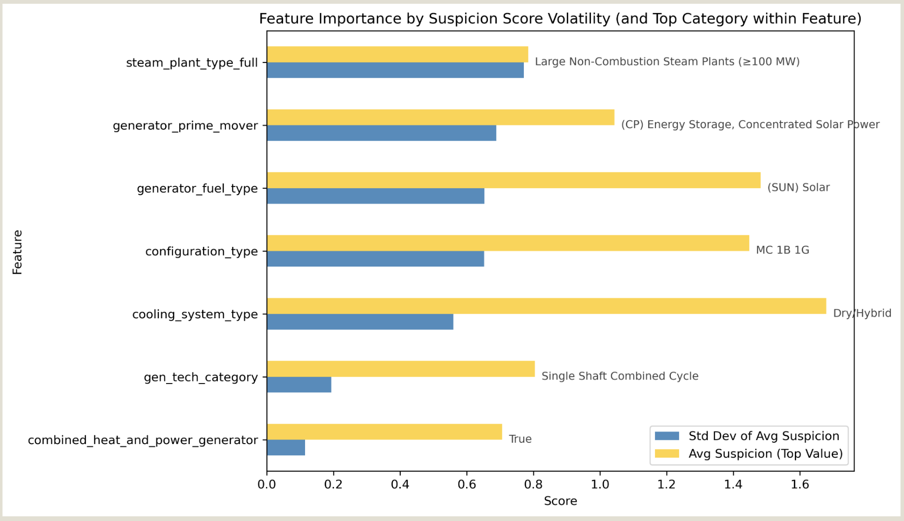
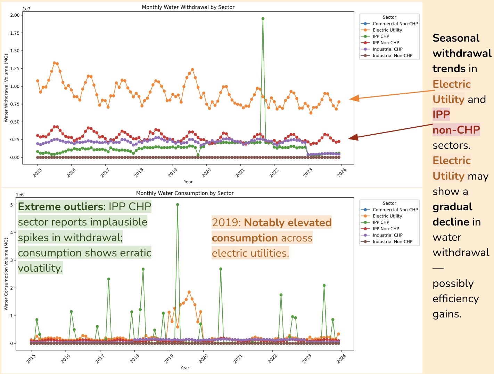
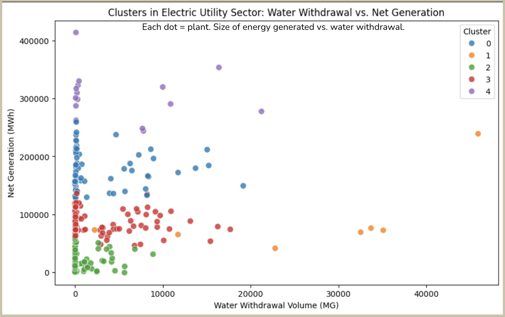

# Hidden Currents: Water Data Quality in the U.S. Power Sector (2015–2023) 🌊

**Project Date:** June 2025  
**Category:** Public Policy & Infrastructure  

## Project Overview

**Objective:** Detect patterns and risks in thermoelectric cooling data to inform real-time anomaly detection for water-use reporting

**Why it matters:** Water stewardship is critical to the energy sector’s efficiency and resilience — especially as climate volatility intensifies. Improving data quality strengthens infrastructure oversight and safeguards public welfare.

**Data:** Public datasets from EIA Forms 860 & 923 (2015–2023)

**Methods:**
- Python & SQL
- Data wrangling & subsetting
- Schema normalization & relational modeling
- Data merging & feature engineering
- Machine Learning: Unsupervised (agglomerative clustering, K-Means)

**Deliverables:**
- [GitHub Repo](https://github.com/amyzhang-commits/eia_water_anomaly_detection)
- [YouTube: Project Walkthrough - *Hidden Currents – Water Data Quality 2015–2023*](https://youtu.be/vj5E-Mj2jR8)

---
## Key Findings

- **Water data from power plants is riddled with structural gaps**, especially among mid-scale thermal plants.
- **Some plants report physically impossible values**, indicating deeper quality issues beyond just missingness.
- **A custom suspicion score reveals high-risk categories** (e.g., complex configurations, solar thermal, nuclear).
- **K-Means clustering flagged suspicious activity zones** worth deeper monitoring.

**Recommendation**: Build classifier using suspicion score, cross-check against USGS data, and prototype real-time anomaly detection.

---

## Key Insights

### 1. Missingness Is Structural, Not Random

**Finding:** Reporting gaps cluster by plant type, technology, and scale.

**Raw Missingness Patterns:**
- Highest among large thermal combustion (fossil fuel) plants—mirroring their prevalence
- Non-steam fossil fuel plants edge out large non-combustion steam plants
- Pattern reflects post-2015 shifts toward renewables, while nuclear remained flat

**After Normalization:**
- Medium thermal combustion plants rank highest in missing data *per plant*
- Non-steam plants (excluding solar and nuclear) show high *average* missingness

> **Note:** Apparent label contradictions (e.g., “Non-Steam / Fossil Fuel” vs. “Large Non-Combustion / Fossil Fuel”) reflect mixed-generation facilities and dataset complexity.

  
**FIG. A.** Heatmap showing plant types ranked across four dimensions of missingness:  
(1) total number of plants in category, (2) total missing entries, (3) average missing values per plant, and (4) average rate of missingness per plant.

---

### 2. Anomalies Beyond Absence

**Physically Impossible Values:** Some plants report *negative* water usage—implying that water is produced during energy generation.

**Extreme Anomaly Types:**

1. **Implausible Efficiency:** Plants 676 & 6639 show near-identical withdrawal and consumption—suggesting a 1:1 usage ratio, highly unlikely for thermal plants.  
2. **Outlier Spike:** Plant 710 exhibits a sudden one-month dip before returning to baseline—likely a data entry error.  
3. **Phantom Activity:** Plant 1262 reports intermittently despite being inactive—skewing missingness calculations.

> **Takeaway:** Anomalies extend beyond absence—reinforcing the need for a broader suspicion scoring system.

  
**FIG. B.** Water withdrawal (left) and consumption (right) patterns for four power plants flagged for anomalous behavior.  
Top and bottom: implausible efficiency (near 1:1 ratios).  
Second: one-time outlier spike.  
Third: inconsistent reporting from inactive plant.

---

### 3. Features That Distinguish Anomalous Plants

**Feature Influence:** Variance in normalized suspicion scores was used as a proxy for feature importance.

**High-Risk Categories:**
- **Large Non-Combustion** (often nuclear) plants show the highest average suspicion  
- **Prime mover = CP (Solar Thermal)** and **fuel type = Solar** rank highly—flagging reporting irregularities  
- **Dry/Hybrid cooling types** appear due to data contradictions (i.e., why is water being reported at all?)  
- **Configuration types MC, IG, IB**, and **Single Shaft Combined Cycle** consistently appear high-risk—likely due to operational complexity  
- **Combined Heat & Power** systems tend to score higher, possibly due to edge-case infrastructure

> As renewable technologies are increasingly deployed alongside aging legacy systems, equipment configurations grow more complex. These findings suggest that even ecologically sustainable plants require more careful resource tracking. Supporting the energy transition means keeping water usage metrics visible and accountable.

  
**FIG. C.** Standard deviation in suspicion scores (blue) used as a proxy for how predictive each feature might be. Yellow bars highlight the most anomalous subcategory within each feature group.

## Bonus: Exploratory Analysis

### 1. Sector-Level Water Trends

**Original Goal:** Estimate future water demand from U.S. data centers using EIA datasets as proxy inputs.

**Outcome:** Infeasible—key identifiers (e.g., NAICS) are absent.

**Seasonal Trends:**  
An analysis of monthly withdrawal and consumption by the dataset's sector labels revealed:
- **Electric Utility** shows a gradual decline in withdrawals—possibly due to efficiency gains (orange)  
- **2019:** Marked by elevated consumption across the Electric Utility sector (orange)  
- **IPP CHP** reports implausible volatility and spikes (green)

  
**FIG. D.** Line graphs of monthly water withdrawal and consumption by dataset's sector labels.

**Lesson:** EIA’s survey-based water data lacks granularity at the sector level. For long-term trend analysis, the U.S. Geological Survey (USGS) is a more reliable authority.

---

### 2. From Suspicion Score Logic to the Black Box

**Experiment:** Applied K-Means clustering to 2023 data from electric utility plants, using Net Generation (MWh) and Water Withdrawal (MG) as features.

**Result:**
- **Cluster 1** isolates outliers effectively  
- Overlap between **Clusters 1 & 3** suggests a fuzzy zone—worth deeper investigation

  
**FIG. E.** Scatterplot of Net Generation (MWh) vs. Water Withdrawal (MG), color-coded by unsupervised K-Means clusters.

**Reflection:** K-Means proved useful as an exploratory tool. Future iterations could explore alignment between manually flagged suspicion scores and unsupervised algorithmic groupings.

---

## Recommendations

### 1. Formalize Suspicion Scoring

Label high- and low-suspicion plants (e.g., top/bottom 10%) and train a classifier to test which features are predictive—this would validate and refine the scoring logic.

### 2. External Validation with USGS

Cross-reference EIA-reported data with USGS benchmarks for top-suspicion plants to assess accuracy and calibrate model inputs.

### 3. Deep-Dive Investigations

- Use suspicion score to interpret unsupervised clusters—do they align?
- Examine 2019 consumption spike more closely
- Prototype a real-time anomaly detection tool based on learned patterns

---

**Tools Used:** Python, SQL, Machine Learning (K-Means, Agglomerative Clustering), Tableau  
**Skills Demonstrated:** Anomaly Detection, Data Quality Assessment, Environmental Policy Analysis, Unsupervised Learning
