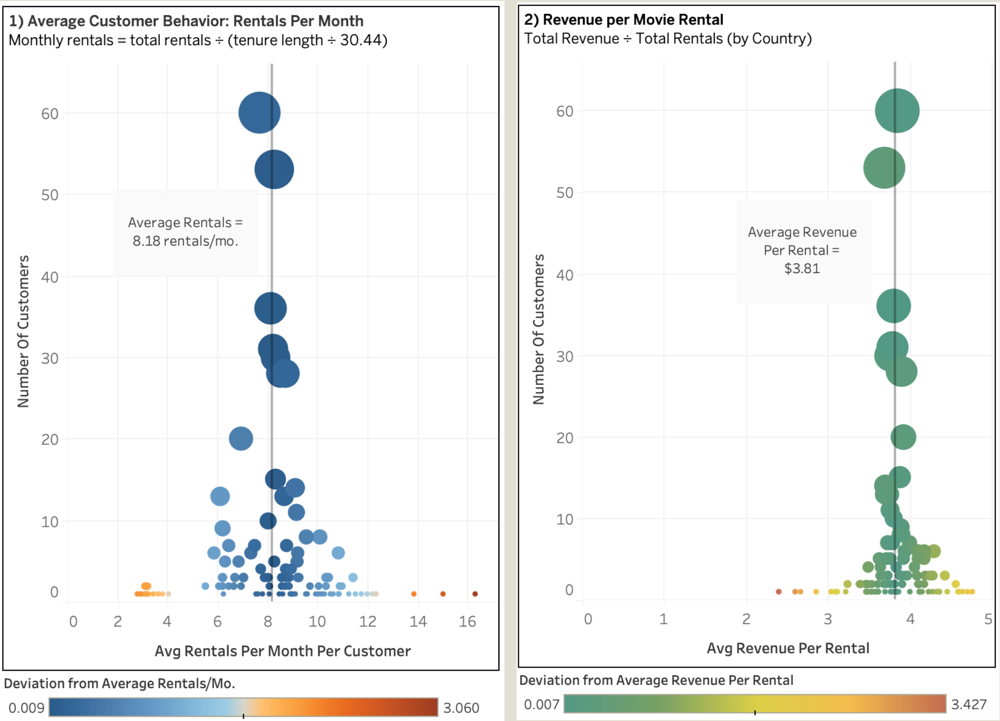
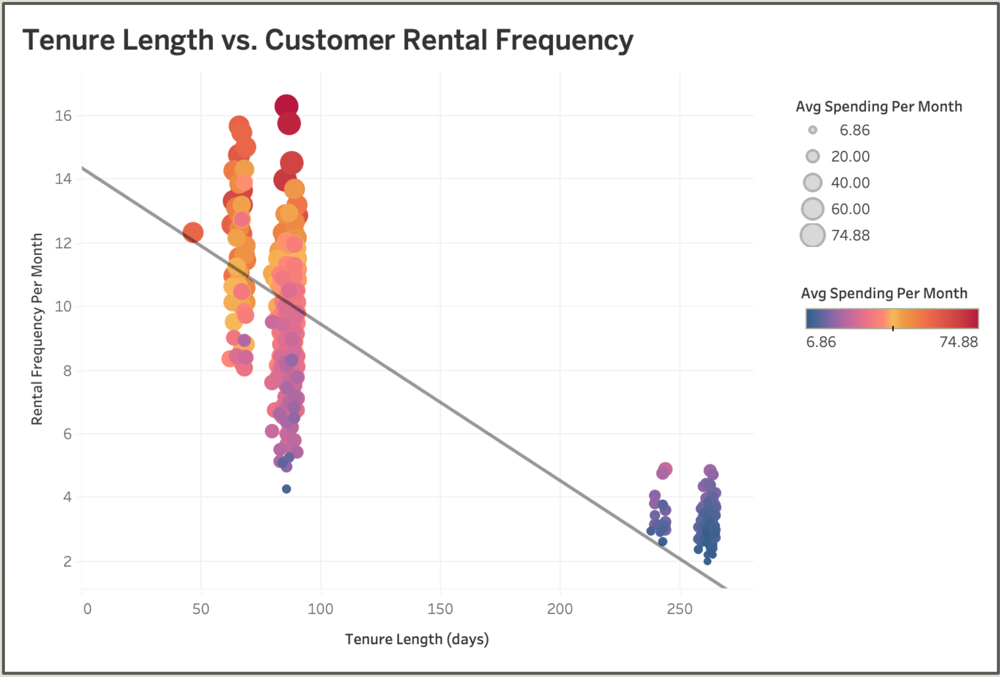
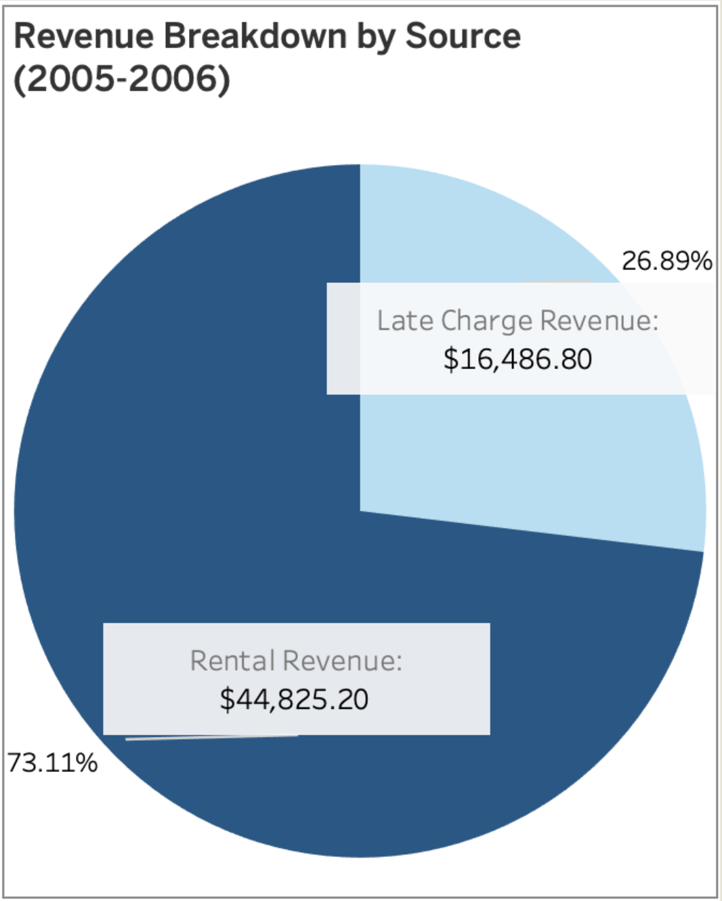
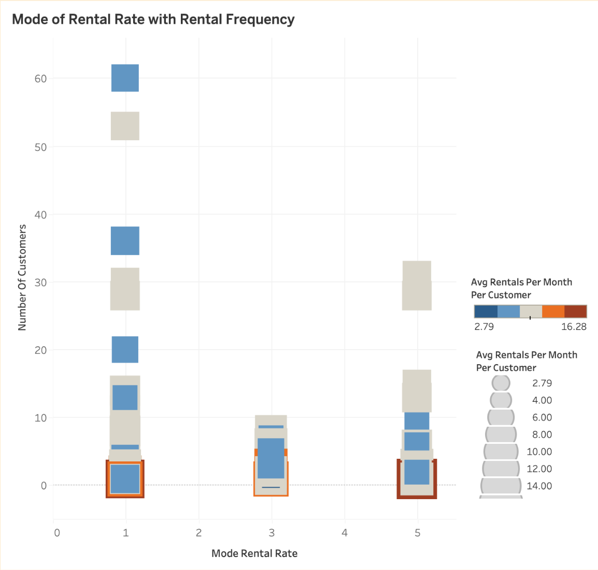

# Rockbuster Stealth LLC 📼

**Project Date:** December 2024  
**Category:** Business Intelligence  

## Project Overview

**Objective:** Use historical rental data to inform customer segmentation and content prioritization for Rockbuster’s upcoming streaming service.

**Data:** SQL-based database including rental transactions, customer demographics, film inventory, and payment data.

**Methods:**
- Queried and managed relational data using SQL
- Compiled a data dictionary to clarify schema relationships
- Joined tables to unify customer, rental, and film details
- Used subqueries and CTEs for layered insights

**Deliverables:**
- [Tableau: Rockbuster Data Analysis](link-placeholder)
- [GitHub: SQL Rockbuster Analysis](link-placeholder)

---

## TL;DR

- Rockbuster’s customer data is highly fragmented, with most regions too sparse for traditional geographic segmentation.
- Engagement drops significantly as customer tenure increases—highlighting a retention gap.
- A surprising 25%+ of revenue comes from late fees, posing a major risk in the streaming transition.
- Exploratory analysis suggests opportunity in tiered pricing based on behavioral clusters, but small-sample volatility is a persistent issue.

**Recommendation:** Prioritize behavioral segmentation over geography, shift away from late-fee reliance, and pilot loyalty-focused streaming plans.

---

## Key Insights

### 1. Customer Fragmentation: Signal vs. Noise in Geographic Trends

**Challenge:** 87% of countries and 73% of districts have fewer than 10 and 1 customer(s), respectively. Sample sizes are too small for reliable geographic trends.

**Solution:** Normalize by population and tenure using a behavior-adjusted engagement rate (rentals per active customer month).

  
***FIG. A:*** *Customer behavior normalized by month: rentals per customer (left); revenue per rental (right)*

**Key Benchmarks:**
- Avg. monthly rentals per customer: **8.18**
- Avg. revenue per rental: **$3.81**

---

### 2. Customer Tenure vs. Engagement

**Critical Finding:** Clear negative correlation between tenure and engagement.

As tenure increases, rental frequency declines—underscoring a need for lifecycle-based retention strategies.

  
***FIG. B:*** *Scatterplot: tenure length (days) vs. monthly rentals, with trend line*

---

### 3. Revenue Streams: Rentals vs. Late Fees

**Concerning Discovery:** Over **25% of revenue** comes from late fees—not rentals.

  
***FIG. C:*** *Revenue breakdown: late fees account for more than a quarter of total revenue*

**Implications:**
- Revenue model is penalty-heavy, not usage-driven
- Late fees won't translate to streaming—requires major shift

---

## Bonus: Exploratory Analysis

### Product Transition Opportunity: Tiered Plans

**Goal:** Identify behavioral clusters to inform streaming tier strategy.

  
***FIG. D:*** *Mode rental rate vs. rental frequency, segmented by customer and market size*

**Insights:**
- **$0.99 rentals** dominate across broad geographies
- **$2.99–$4.99 tiers** cluster in small but active user bases
- High-frequency users are often geographically isolated—caution in overgeneralizing

**Limitations:**
- Mode can obscure nuance (e.g., dominance vs. frequency)
- Suggested enhancement: combine rental frequency × price mode × segment size

---

## Recommendations

### 1. Focus on Platform Offerings  
Geographic targeting is unreliable. Instead, expand inventory in top-performing genres (by rental revenue/title): **Sci-Fi**, **Action**, **Animation**.

### 2. Address the Tenure Drop-Off  
Introduce subscription plans and loyalty rewards to stabilize engagement over time.

### 3. Move Beyond Late Fees  
Pivot away from penalty-driven revenue with tiered streaming plans that align with behavioral segments.

---

**Tools Used:** SQL, Tableau  
**Skills Demonstrated:** Complex Queries, Data Normalization, Market Segmentation, Business Model Assessment
